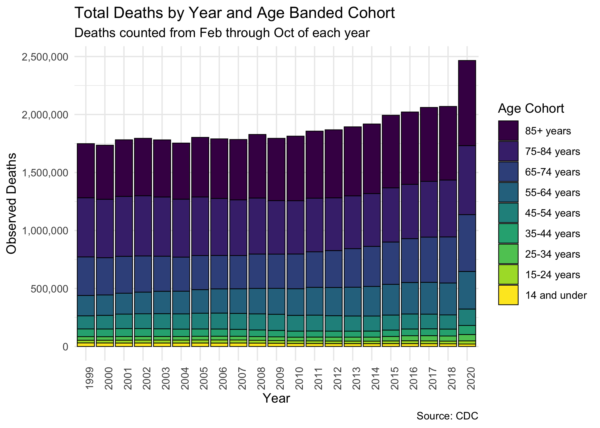
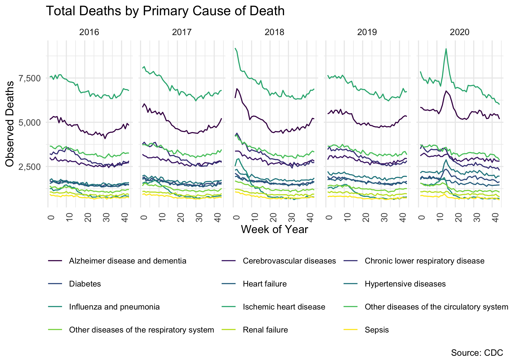

## Source data

Source data is obtained at
<https://data.cdc.gov/NCHS/Provisional-COVID-19-Death-Counts-by-Sex-Age-and-W/vsak-wrfu>.

## Validation: Recreation of Briand’s Chart

To validate the data, first I will recreate some of the exhibits in
Briand’s lecture featured in the article. Since I’m using R instead of
Excel, I can use the Viridis package, which is helpful for people
experiencing colorblindness in viewing color-contrasted visualizations.

    ## [1] "That worked OK? TRUE"

This chart lines up very nicely with Briand’s version of the same
presentation, so I’m happy to call this a good shot at making sure we’re
dealing with the same data. I’m calling the validation portion of this
exercise complete.

Let’s also take care to note that the preceding graph does *not*
describe the mortality rate broken out by cohort. Rather, it describes
the proportion of observed deaths out of the total number of observed
deaths, broken out by age cohort. These two things are very different
measurements, though a quick reading of the article in question appears
to (a) make a case for the lack of excess deaths observed in 2020 which
is, to be technical, totally nutso; and (b) sets up the argument that
there is some kind of misunderstanding of COVID mortality figures
because the total proportion of mortality by age group has not changed
over time. Again, trying to be totally charitable here, but I refer you
to the following direct article quotation:

> “These data analyses suggest that in contrast to most people’s
> assumptions, the number of deaths by COVID-19 is not alarming. In
> fact, it has relatively no effect on deaths in the United States.”

Let’s explore this assertion further.

## What Can We Learn from this Chart?

Now we’ll look at another presentation of the data available on the CDC
website, where we take the total overall proportion of deaths, and slice
and dice that by age cohort, and by time period, and look at this in
data visualization again in different ways - and you are free to modify
and run this code to explore different angles yourself!

Using the [CDC Wonder](https://wonder.cdc.gov/ucd-icd10.html) system we
can query mortality by the same age banded cohorts all the way back to
1999! Use of this system requires you agree to not use the data for bad
purposes such as using it to positively identify people, so I can’t
write the code that generates this document to pull the data in
automatically. Nonetheless, the data used here is retrieved from the
link above on Sat Nov 28 2020 at around 8:30 PM. Finally, since death is
seasonal over time I’m only going to look at data on an annual basis,
but split out into the same age-banded cohorts.

This graph should look unsurprisingly similar to the one in the previous
section. The one difference we can see is that the larger time horizon
allows us to take into perspective the slowly shrinking 75-84 age band.
This absolutely does *not* mean fewer people are dying *in aggregate*.
In fact, due to population increases and other reasons, *more* people
are dying (judged on the basis of just raw death counts).

So, all this chart can tell us is that it appears more and more folks
are moving to the 85+ band or to other bands out of the 75-84 age band.
A concurrence of phenomena are at play here: people are are living
longer is just one bit of the answer.

The point of this initial discussion is that we can glean absolutely no
information whatsoever about total excess mortality in the US *in
aggregate* from the presentation of the data in this manner. Doing so
with this chart amounts to academic catfishing, in my opinion.

## Actual Mortality Rates Over Time

Now let’s take a look at mortality *rates* over time broken out by the
age cohorts.

What a lovely sight! Mortality *rates* appear to be going down for the
elderly! The compression of the mortality curves down at the bottom
conceals a bit of a tragedy we’ll unearth in a moment, but we can see
that, in general, it’s never been a better time to be elderly in
America.

## Age-adjusted Mortality

Now we’ll look at a proxy for what the CDC refers to as **age-adjusted
mortality**. It is essentially a weighted calculation with population
volumes in each cohort as the weighting mechanism.

We’ll capture that in another view similar to the first two graphs,
where we’ll break down each age cohort’s contribution to the total
mortality rate in the US for that year.

This is interesting because it tells a slightly different story than the
prior graph - that expressed as a percentage of the population, deaths
*in aggregate* are on the rise in the last decade or so in the US.

This is unsurprising: we see that the largest percentages of death are
focused into the elder age bands, but we already know that these age
bands are seeing decreased mortality rates. In fact, we can see in this
graph more clearly the substantial increase in the size of the middle
age bands, confirming what we know to be true about the toll of the
Opioid Crisis in the US over the last decade.

## Putting it all together

One thing I’d like to do now is combine the historical data I’ve
obtained with the 2020 COVID dataset, but the latter does not have a
population total tabulation by age. Because I am holding myself to
building visuals using *only* actual available CDC data, I will instead
just plot raw deaths over time, from 1999 - 2018, and 2020, all on the
same graph.

We have a problem, though. Our CDC data is really complete through, at
best, 10/31/2020, and it is also missing January 2020! So I’m going to
have to go back to CDC Wonder to grab total historical death figures by
month and year instead of just by month. I’ve got the monthly data
pulled in the file `Underlying Cause of Death, 1999-2018_pull2.txt` and
cut out January, November, and December for each year so that we’re
dealing with a genuine apples-to-apples comparison.

Because I think we’ve thrashed this dead horse, and because I like to
end on a “cut the crap” visualization that shows things as they are, no
filtration, no rates, just raw numbers and sizes and colors: I present
to you a stacked histogram of raw deaths over time in the US.

That’s a pretty clear difference observed here. You can make a case for
some of the differnce due to 2019 being skipped due to lack of data
availability, but unless 2019 was some kind of mysterious slaughterhouse
event and 2020 is expressing the new normal, then what we see here is
very plainly due to excess mortality.

> Briand also noted that 50,000 to 70,000 deaths are seen both before
> and after COVID-19, indicating that this number of deaths was normal
> long before COVID-19 emerged. Therefore, according to Briand, not only
> has COVID-19 had no effect on the percentage of deaths of older
> people, but it has also not increased the total number of deaths.

> These data analyses suggest that in contrast to most people’s
> assumptions, the number of deaths by COVID-19 is not alarming. In
> fact, it has relatively no effect on deaths in the United States.

I mean this with all due professionalism: **GTFOH.**

## Maybe She’s Born With It? Maybe it’s Cherry Picking

This is a bonus section - I want to scrutinize an exhibit Briand put
together about reporting discrepancies. I’m talking about this image:

To go along with this exhibit we have this juicy nugget:

> This trend is completely contrary to the pattern observed in all
> previous years. Interestingly, as depicted in the table \[above\], the
> total decrease in deaths by other causes almost exactly equals the
> increase in deaths by COVID-19. This suggests, according to Briand,
> that the COVID-19 death toll is misleading. Briand believes that
> deaths due to heart diseases, respiratory diseases, influenza and
> pneumonia may instead be recategorized as being due to COVID-19.

Then the icing on the cake is the historical pattern of deaths plotted
by cause for the last 5 years, and inset on that graph is a depiction of
this small sliver of 6 weeks in which COVID data is reported in a
seemingly nonsensical way while heart disease data drops. Here it is:

Isn’t it plausible to believe in the early days of the pandemic, when we
were first figuring out which end is up, how testing could be done
reliably, and getting hospital systems worked out for the long haul -
that some cases were misreported as other things? I believe so, and I
don’t think that’s malicious, and I don’t think Briand would think that
either.

Let’s re-create this chart, but using better tools that we can access in
R. If I’m going to take this argument seriously (that is, the argument
that COVID-19 mortality is overstated due to systemic erroneous
cause-of-death reporting), then I would want to see continued evidence
of this reporting anomaly sustained throughout 2020 and not just in the
opening months of the pandemic.

To build a whole case on there being systemic misreported COVID data
based on three weeks of data is a risky move, and we’re going to take a
look at the CDC data again, now split out by cause of death.

    ## [1] "That worked OK? TRUE"

Again, and I say this with all due force of professionalism, **she
should stick to running a master’s program in Economics at the Hop and
stay away from mortality analysis**.

– This is an R Markdown document. Markdown is a simple formatting syntax
for authoring HTML, PDF, and MS Word documents. For more details on
using R Markdown see <http://rmarkdown.rstudio.com>.
